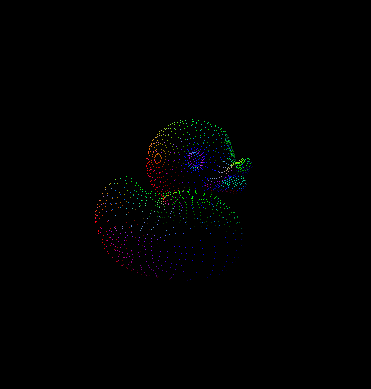
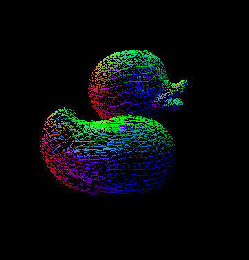
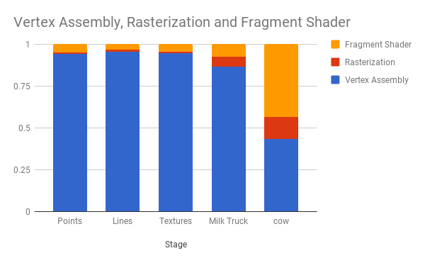
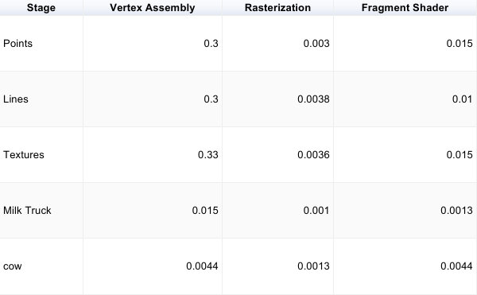

CUDA Rasterizer
===============

**University of Pennsylvania, CIS 565: GPU Programming and Architecture, Project 4**

* Wenli Zhao
* Tested on: Windows 10 Pro, Intel Xeon CPU CPU E5-1630 v4 @ 3.70GHz 32GB, NVIDIA GeForce GTX 24465MB (Sig Lab)

### README

In this project, I implemented a simplified graphics rasterizer pipeline which includes vertex shading, primitive assembly, rasterization, fragment shading, and a framebuffer.

The core features I implemented included:
* Vertex shading. 
* Primitive assembly with support for triangles read from buffers of index and
  vertex data.
* Rasterization.
* Fragment shading.
* A depth buffer for storing and depth testing fragments.
* Fragment-to-depth-buffer writing with atomics
* A fragment shader with simple Blinn-Phong lighting scheme.

In addition to the basic rasterizer, I implemented UV texture mapping and support for rasterization with points and lines.

#### Texture Mapping

#### Points

#### Lines

### Analysis

The features I implemented didn't have too much of a performance impact on the models I tested. For example, the first three bars of the chart have a similar distribution. For rasterization of points and lines, I didn't change vertex assembly very much, so the bottleneck remained there. Vertex assembly contains a lot of global memory calls that slow down the pipeline. In general, the fragment shading and rasterization were pretty quick. I think I might have corrupted the cow model since it gave a very different distribution. I'm still not exactly sure why. There is a lot more I could do to accelerate various parts of the rasterization pipeline. I could potentially use shared memory for texture sampling and used tile-based rendering to accelerate my pipeline.

### Credits

* [tinygltfloader](https://github.com/syoyo/tinygltfloader) by [@soyoyo](https://github.com/syoyo)
* [glTF Sample Models](https://github.com/KhronosGroup/glTF/blob/master/sampleModels/README.md)
